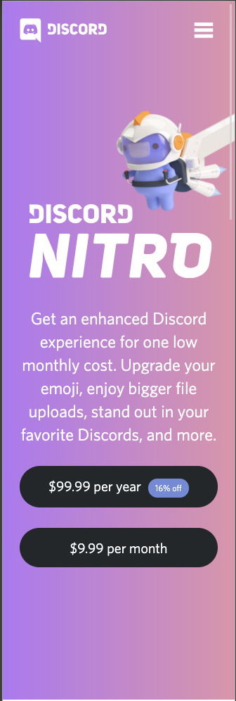
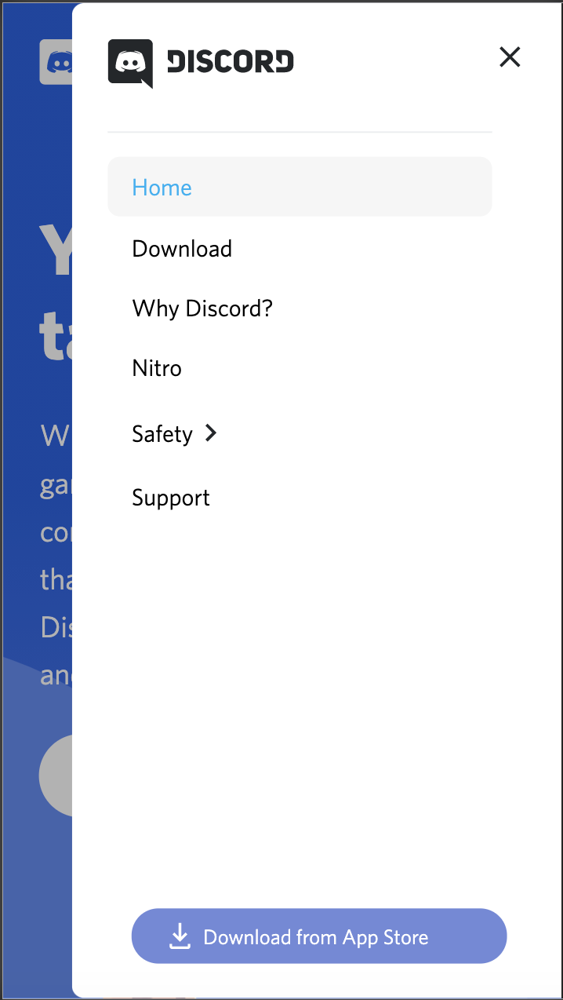
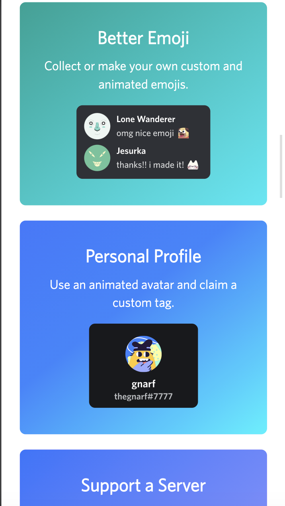
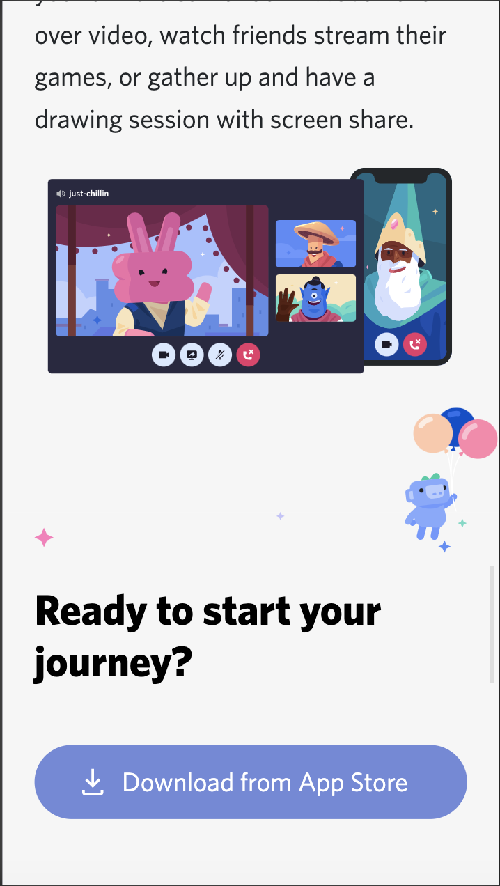
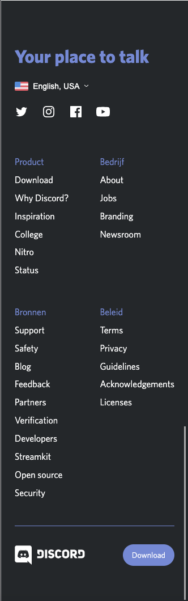
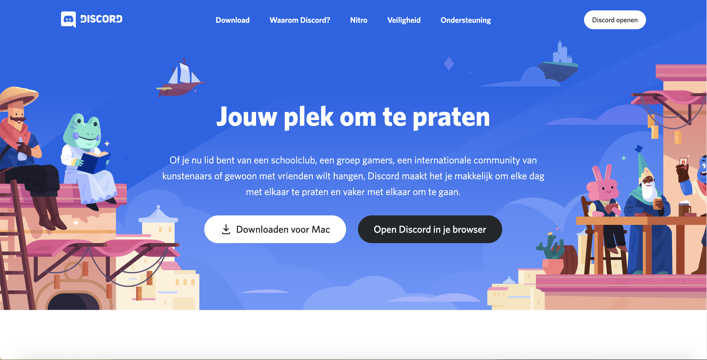
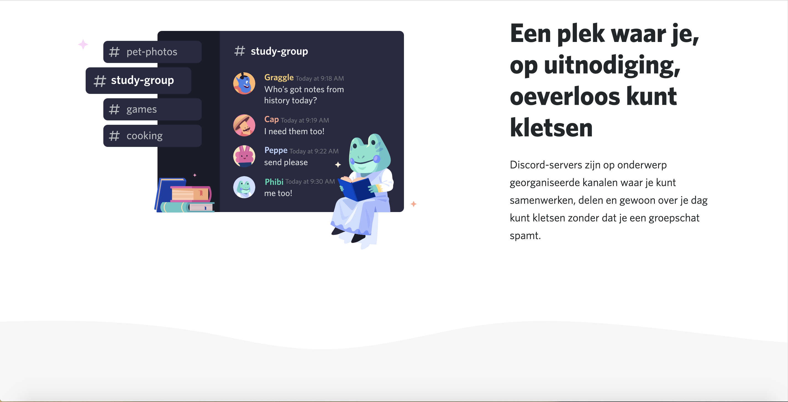
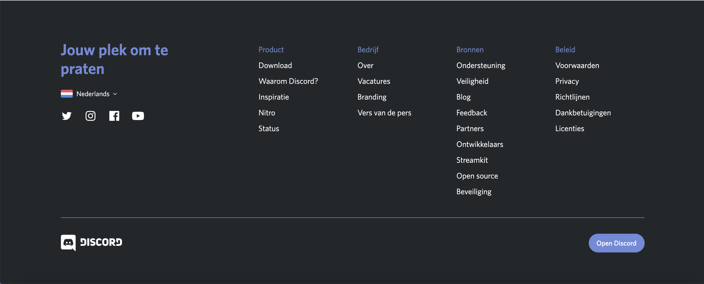
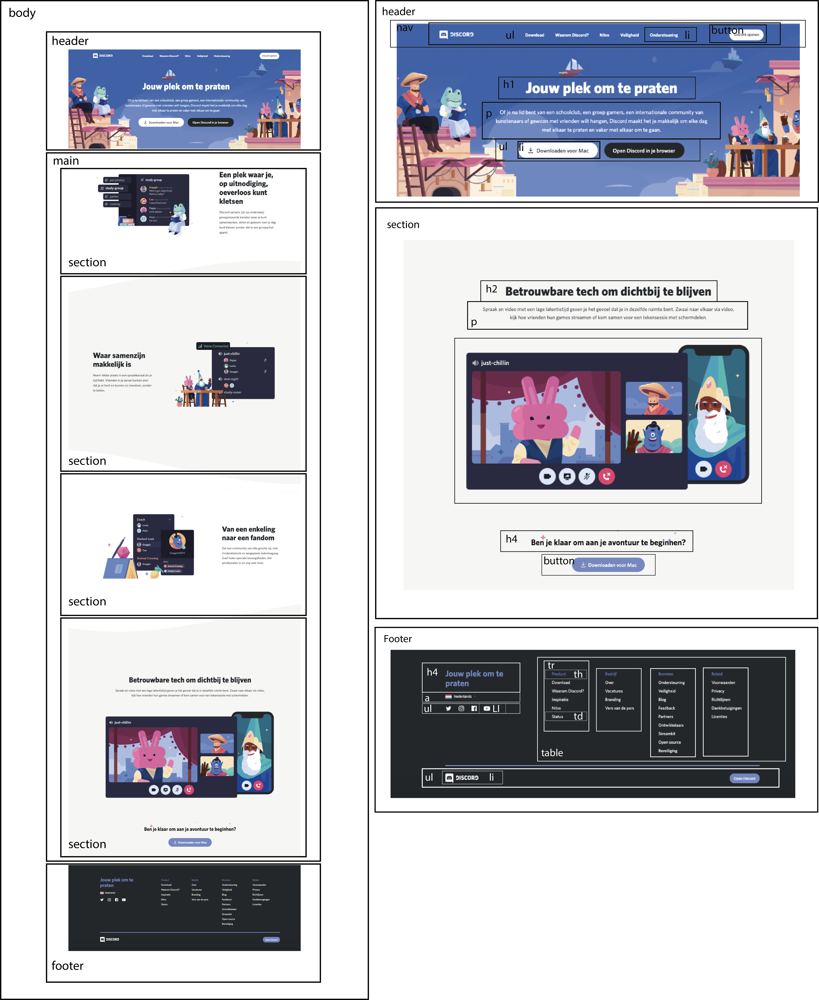

# Procesverslag
**Auteur:** Julian de Cloe

Markdown cheat cheet: [Hulp bij het schrijven van Markdown](https://github.com/adam-p/markdown-here/wiki/Markdown-Cheatsheet). Nb. de standaardstructuur en de spartaanse opmaak zijn helemaal prima. Het gaat om de inhoud van je procesverslag. Besteedt de tijd voor pracht en praal aan je website.

## Bronnenlijst
1. Alle afbeeldingen zijn afkomstig van https://discord.com/

## Eindgesprek (week 7/8)

Ik heb voor een tijdje gekeken naar een image draggable maken, dit ging mij helaas nog het verstand te boven. Echter had ik er gelukkig toch geen nut voor gevonden. Ik heb mijn tweede pagina afgemaakt met wat leuke toevoegingen. Ik had ook een probleem met een font implementeren, maar dit heb ik na wat snelle onderzoek op internet opgelost. 

**Screenshot(s):**

## Voortgang 3 (week 6)

### Stand van zaken

Het menu is gefixed, maar ik loop erg achter. Heb nog geen tijd gehad om naar drag and drop te kijken. Hier zal ik in de vakantie naar moeten kijken. Ook wil ik voor pagina 1 nog wat kleine animaties toevoegen.

**Screenshot(s):**

### Agenda voor meeting

Onderdelen die besproken moeten worden:
- Problemen met positioneren en image plaatsen in button
- Form elementen stylen
- Hamburger menu op mobile naar volledig menu op desktop

### Verslag van meeting
We hebben nog even gekeken naar mijn menu. Het was al af en zag er goed uit, maar ik kreeg wat extra mogelijkheden uitgelegd. Daarnaast moet ik nog steeds kijken naar de opacity van sections verhogen wanneer ze in beeld komen. 

## Voortgang 2 (week 5)

### Stand van zaken

De footer is af en derest van de home pagina, behalve het menu. Volgende week ga ik aan de slag met het menu en draggable maken van een element.

**Screenshot(s):**

### Agenda voor meeting

Onderdelen die besproken moeten worden:
- Grid
- Media queries
- draggable functies
- navbar die van content veranderd
- Hoe te beginnen met de 2e pagina.

### Verslag van meeting

Gaat goed met het de site. Waar ik nog naar moet kijken is het drag and drop event om mogelijk toe te passen als surface plane onderdeel.

## Voortgang 1 (week 3)

### Stand van zaken

Ik heb tot zover nog geen problemen gehad. Het enige waar ik tegenaan loop is dat het icoon in de button hoger is dan de tekst in de button. Ik heb dit nog niet kunnen fixen.

**Screenshot(s):**

### Agenda voor meeting

- Vragen over responsive
- Hoe je opacity omhoog laat gaan als element in beeld komt.

### Verslag van meeting

Als je scrollt moeten de onderdelen tevoorschijn komen. Javascript -> scroll & opacity omhoog met class.

## Intake (week 1)

**Je startniveau:** -kies uit zwart, rood óf blauw-

Rood/Zwart

**Je focus:** -kies uit responsive óf surface plane-

Surface plane 

**Je opdracht:** -link naar de website die je gaat namaken óf de naam van je eigen ontwerp-

https://discord.com/

**Screenshot(s):**

**Breakdown-schets(en):**

